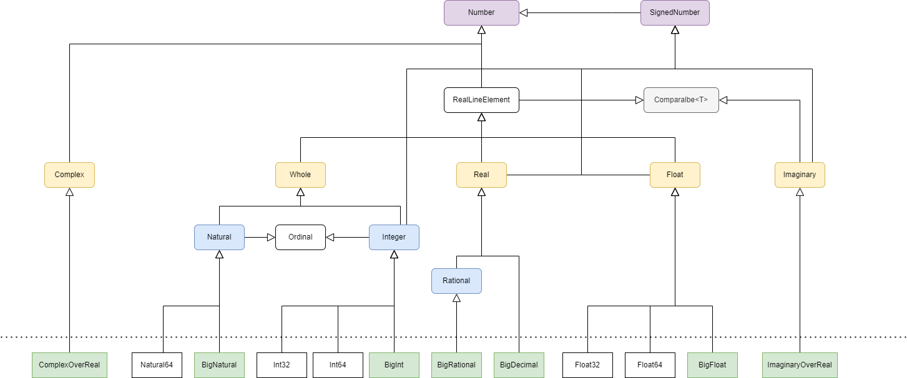

title=Numbers
date=2016-04-03
type=post
tags=tour, lense
status=published
~~~~~~

== Numbers

Numbers are separated in specific algebraic structures that conform to the mathematical rules of their group of elements.

All numbers are descendant types of the `Number` type. Operations are defined for each type independently.
Lense supports Complex and Imaginary numbers. 

NOTE: Even thought is possible the performance of the  Complex and Imaginary types may not be optimal, Lense perfers complete design to performance.

* `Whole` - numbers with no decimal part.
	** `Natural` - Represents elements from the mathematical **&#8469;** set, i.e. positive only whole values that include zero and range from zero up to maximum value limited only by available memory
	** `Integer` - Represents elements from the mathematical **&#8484;** set, i.e. negative and positive whole values.
		***  `Int32` - negative and positive whole values with range from -2^31^ to  2^31^-1. Also implements `binary`.
		***  `Int64` - negative and positive whole values with range from -2^63^ to  2^63^-1. Also implements `binary`.
		***  `BigInt` - negative and positive whole values with arbitrary range limited only by available memory
* `Real` - Represents elements from the mathematical **&#8477;** set.
	**  `Rational` - Represents elements from the mathematical **&#8474;** set, i.e. rational numbers defined by a natural numerator and a natural denominator like 2/3 or -5/8. The denominator cannot be zero. 
		*** `BigRational` - Represents rational numbers using an Integer as numerator and a Natural as denominator.
	** `BigDecimal` - Represents elements in the **&#8477;** set including truncated version of irrational numbers. Negative and positive real values with arbitrary precision limited only by available memory.
* `Float` - Represent elements in the extended real line **&#8477;** &cup; (-&infin;, +&infin;) with suport for Not a Number (NaN) 
	** `Float32` - negative and positive float values that follow 32 bits IEEE 3744 conventions
	** `Float64` - negative and positive float values that follow 64 bits IEEE 3744 conventions
	** `BigFloat` - negative and positive float values implemented as a fraction of two Integers with special mechanics to represent -&infin;, +&infin; and NaN. 
* `Imaginary` - Represents elements from the mathematical **&#120128;** set. Numbers with pure imaginary parts of the form `bi` where `b` is a `Real` and `i` is the square root of -1.
	** `ImaginaryOverReals&lt;T extends Real&gt;` - uses a `Real` type to store the numeric value
* `Complex` - Represents elements from the mathematical **&#8450;** set. Complex numbers are of the form `a + bi` where `i` is the square root of -1.
	** `ComplexOverReals&lt;T extends Real&gt;` - Use a `Real` type to store the real and imaginary numeric values.

Type `Natural` is use to represent sizes and as an indexer for `Sequence` s. Size limits to collections like arrays, lists and maps are only bound by the limit of Natural which in turn is limited only by available memory.
Using a Natural to index sequences removes the necessity to check for negative indexes and because `Arrays` always have a upper limit and always are constructed by link:constructors.html#factory[factory like constructors] the implementation for each platform can accommodate different implementations according to maximum length demand.

For more information on how Natural relates to index of sequences, see how link:arrays.html[Arrays] work in Lense.
For more information on arithmetic operations  more on Lense link:operators.html[operators].

=== Number Literals 

Literals with no decimal part are always assumed `Natural` and in base ten representation. If the Literal is preceded with a `-` sign, then the literal is assumed an `Integer`.
The natural values are transformed to other types as needed. This conversion may rise an `OverflowException` because a `Natural` can exceed the maximum values of other types. 
For example, attributing a natural to a Int32.

For literals with a decimal part , they are always assumed `Rational`. This is because irrational numbers cannot , in general, be represented literally.

When defining variables of other types, Lense used target casting.

[source, lense]
----
	let Natural n = 1; 

	// literals are always assumed to be Natural and promoted when necessary
	let i : Int32 = 1; 
	let k : Int64 = 1; 
	let g : BigInt = 1;
	
	// If the target type is Whole or Integer, the literal it's equivalent to having BigInt as target 
	let w : Whole = 1; 
	let u : Integer = 1;  
	

	// decimal values are always assumed to be Rational
	let rr : Rational = 1.4 
	let ff : Decimal32 = 1.6; 
	let d  : Decimal64 = 2.0;
	let m  : BigDecimal = 1.234567890E100; 

	// Rationals are also defined by the division of two whole values. 
	let r : Rational = 2/3; 
	let q : Rational = -5/8; 
	let q : Rational = -x/y; 

	// imaginary literals end with an `i`
	let a : Imaginary = 2i;
	let b : Imaginary = 2.5i; 
	
	let error : Imaginary = 2; // does not compile because a Natural can not be converted to an Imaginary number

	// complex numbers are defined by operations between real and imaginary values
	let c: Complex = 5 + 2i; 
	let d: Complex = 3.9 + 0.2i; 
----

Remember that typing is optional, so its possible to just right:

[source, lense]
----
	let n = 1;  // n is a Natural 
	let g = -1; // g is an Integer
	
	let r = 1;0;  // r is a Rational 
	let d = -1.0; // d is an Rational
	
	let a = 2i; // a is Imaginary
	let c = 5 + 2i; // c is Complex 
----

In any representation you can use underline (`_`) to logically separate digits in the value to help readability.

[source, lense]
----
	let x : Integer -1000000;
	// or
	let x : Integer = -1_000_000;
	// or simply
	let x = -1_000_000;
----

==== Other Bases for Literal Representations 

Numeral literals are assumed to be represented in decimal form (base 10) for all types. 
For naturals it is also possible to use the hexadecimal (base 16) form.

The hexadecimal form begins with a `#` symbol followed by a valid hexadecimal digit: 1, 2, 3, 4, 5, 6, 7, 8, A , B, C, D , E , F. You can also use _ to separate digits like in base ten representation.

[source, lense]
----
	let  color : Natural = #FF_EE_00; // hexadecimal
	// or simply
	let  color = #FF_EE_00; // hexadecimal
----

== Arithmetic

Lense will select the implementation of Natural or Integer that best suits the literal. 
When performing arithmetic operations Lense will automatically promote the value to a larger implementation that can contain the value.
Eventually a `BigNatural` or `BigInteger` type will be necessary. 

BigRational and BigFloat use Integer and Natural so the numerator and denominator is adjusted to smaller value possible.